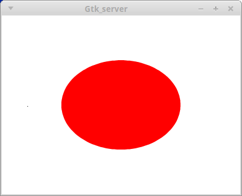
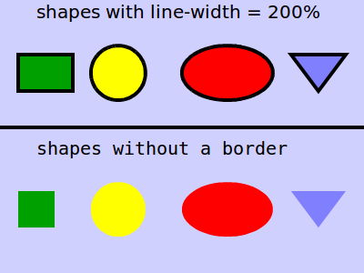
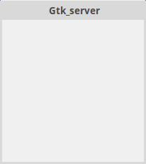
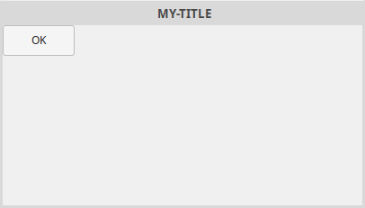
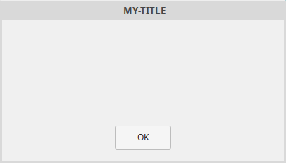
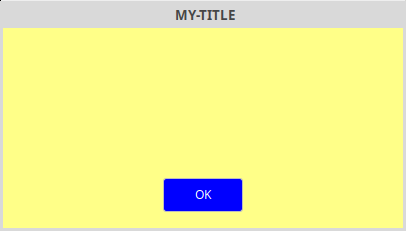
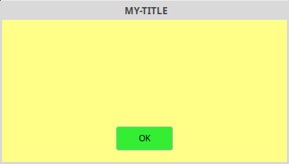

// vim: et:ts=4:sw=4

= The GNU APL *⎕GTK* Cookbook
:toc:
:toclevels: 4

:Author: Jürgen Sauermann, GNU APL
:page-width: 90em

////
make window visible, then

scrot --border -d 5 -u

and move mouse to window within 5 seconds

-or- for glade XML:

{ cat << ENDCAT
<?xml version= ...
ENDCAT
} | glade-previewer -f /dev/stdin --screenshot glad-XXX.png
////

== Abstract

⎕GTK is a GNU APL system function that allows an APL program to create and
control a graphical user interface (GUI). The GUI is based on Gtk+ (Gimp
Toolkit) version 3+ (aka. GTK 3+). This document describes, by means of
simple examples, how *⎕GTK* based GUIs can created and managed from GNU APL.

== Philosophy

A modern GUI such as Gtk provides a powerful API for controlling almost every
aspect of the GUI. A consequence of that power is an API that consists of
thousands of functions. The entire Gtk API is spread over 11 different
libraries:

----
$ pkg-config gtk+-3.0 --libs
-lgtk-3 -lgdk-3 -latk-1.0 -lgio-2.0 -lpangocairo-1.0 -lgdk_pixbuf-2.0
-lcairo-gobject -lpango-1.0 -lcairo -lgobject-2.0 -lglib-2.0
----

Each library contains tens, hundreds, or even thousands of symbols. Every
symbol represents either a function or a variable, and the vast majority of
symbols in the different libraries represent functions.

.Gtk API Symbols
[options="header, footer"]
[width="60%"]
|===============
| Gtk Library          | Number of Symbols
| libgtk-3.so          | 4176
| libgdk-3.so          | 632
| libatk-1.0.so        | 265
| libgio-2.0.so        | 1872
| libpangocairo-1.0.so | 33
| libgdk_pixbuf-2.0.so | 117
| libcairo-gobject.so  | 33
| libpango-1.0.so      | 405
| libcairo.so          | 395
| libgobject-2.0.so    | 427
| libglib-2.0.so       | 1595
| TOTAL                | 9950
|===============

These numbers suggest that mapping every Gtk function to a corresponding APL
function would create an almost unusable API at APL level. Even the approach
used for ⎕FIO or ⎕SQL - using function numbers as APL axis elements - reaches
its limits when used with almost 10000 functions.

Now, the huge number of API functions in the different Gtk libraries contrasts
considerably with the moderate number of widgets (around 80) in a GUI and even
more with number of actions (like clicking, marking text, typing text, etc.)
that a user can do with each of the widgets.

If we look at the program *glade*, which is the default tool for constructing
Gtk based GUIs, then we see that there are 12 top-level widgets
(aka. "windows"), 20 containers (widgets containing other widgets), and 36
control widgets (most of them variants of the same base widget, like different
types of buttons).

This discrepancy between the huge number of functions in provided by Gtk and
rather small number of things that a user can do (like: click on a button,
select an item in a selection box, enter text in some text entry, etc)
or perceive (color, font, etc.) suggests that there might be a clever way to
control a GUI without mapping each of the almost 10000 Gtk functions to a
corresponding APL function in a 1:1 fashion.

⎕GTK uses a rigorous approach to reduce the number of functions:

* Every GUI must be described by a suitable *XML file* or *XML string*.
** Suitable *XML files* can with the GUI construction tool *glade* (which
   comes with GTK), while
** suitable *XML strings* can be constructed programmatically in APL (see
   workspace *SQL_GUI* which contains examples for *⎕GTK* and ⎕SQL).
//-
  This requirement reduces the need for all
  functions that are concerned with the instantiation of the GUI elements and
  their properties. It also speeds up the design of the GUI itself.

* To the extent possible, visual widget aspects that are usually static (i.e.
  that do not change over time) such as colors are required to be specified
  with CSS (Cascading Style Sheets). This requirement eliminates the need
  for the corresponding GTK functions that would otherwise control these
  aspects, which further reduces the number of Gtk API functions needed.
  It also speeds up the design of the GUI itself. The downside is a somewhat
  static look-and-feel of the GUI, because, for example, colors cannot be
  changed after the GUI was instantiated.  However, the benefit of fancy
  dynamic GUIs (if any) seems not to justify the complexity in the API
  that would be needed to support them.

* Implementation on demand. *⎕GTK* starts with a rather small (and therefore
  incomplete) set of GTK widgets and events, but has a simple way to extend
  that set. The mapping between *⎕GTK* on one side and libgtk functions and
  events on the other side is defined in a single macro file *Gtk/Gtk_map.def*
  that can be easily extended to accommodate new widgets and signals,

== Architecture

The philosophy above has been implemented in the following architecture.

. The Gtk GUI itself has been implemented in a separate process running the
program *Gtk_server*. The Gtk_server is linked with the different Gtk
libraries, so that Gtk itself remains outside GNU APL.

. The *Gtk_server* is started by *⎕GTK*, and after that *⎕GTK* communicates with
  Gtk_server over a socket pair. The communication consists of a sequence of
  TLV (Tag/Length/Value) buffers encoded with 33 ⎕CR and decoded with 34 ⎕CR
  (aka. ¯33 ⎕CR) at the APL end. A user action (e.g. a button click) results
  in an "event" (= a TLV buffer) received by APL while an "command" (sent from
  APL to the Gtk_server results in some change in the GUI. However, many
  details such as a button changing its form or its color when being pressed
  are handled by the Gtk_server server process (resp. one of the Gtk
  libraries) and are not communicated to APL. The encoding and decoding of
  TLVs that are exchanged between *apl* and *Gtk_server) takes place inside
  *⎕GTK* so that the APL programmer is not concerned with the details of
  this communication.
----
                                                          ╔════════════════════════════╗
                                                          ║ GUI-description.xml file   ║
                                                          ║  ↓ GUI-stylesheet.css file ║
                                                          ║  ↓  ↓                      ║
                                                          ║  ↓  ↓   ┌───────────────┐  ║
                                                          ║  ↓  ↓   │    GTK GUI    │  ║
    ╔════════════════╗      Commands                      ║  ↓  ↓   └─┬─────────┬┬──┘  ║
    ║ GNU APL     ┌──╨───┐  33⎕CR → → →         socket    ║┌──────────┴─┐   ┌───┼┴────┐║
    ║ application │ ⎕GTK ├───────────────────────-----────╫┤ Gtk_server │ ┌─┴───┴────┐│║
    ║ program.apl └───╥──┘  34⎕CR ← ← ←          pair     ║└────────────┘ │ GTK libs ├┘║
    ╚═════════════════╝     Responses, Events             ║               └──────────┘ ║
                                                          ╚════════════════════════════╝
----
[start=3]
. One Gtk_server handles a single top-level window and its children (see also
  <<TAG_caveats, Caveats>>.
. For GUIs that consist of multiple top-level windows, one apl interpreter
  process can start several Gtk_server processes.

== Development Work-flow

The architecture above leads to the following work-flow.

1. The programmer specifies the GUI by means of the *glade* GUI design tool
   that comes with Gtk. The result is an XML file that describes the GUI, The
   XML file can be changed later on as needed, so that the programmer can
   start with a subset of the GUI functionality and then extend that
   functionality in an incremental fashion.

2. The programmer writes a CSS specification for the the widgets in the GUI.
   The CSS file specifies the styling (i.e. colors. sizes etc.) of the
   widgets. In theory, this step is optional, but in practice inevitable for a
   somewhat good-looking GUI.

3. The programmer write a brief start-up code for the GUI in which the files
   created in steps 1. and 2. above are being loaded into the GUI.

4. the programmer displays the GUI - either at the start of the APL
   application if the GUI shall be permanently visible or at some time
   if the GUI is, for example, only popped up in order to request input
   from the user of the APL application. In the latter case the GUI is
   a single window (a "modal dialog") which is polled from APL until some
   final action of the user has occurred, while the former case the APL
   application has to poll the GUI for events at rather short intervals.
   to poll *⎕GTK* at regular intervals.

----
    ╔══════════════════════╗
    ║  GUI Design (glade)  ║   →  my-application.ui
    ╚══════════╤═══════════╝
               │
    ╔══════════╧═══════════╗
    ║ Widget Details (CSS) ║   →  my-application.css
    ╚══════════╤═══════════╝
               │
    ╔══════════╧═══════════╗
    ║   APL application    ║   →  my-application.apl
    ║ ──────────────────── ║
    ║      GUI start       ║   → loads my-application.ui and my-application.css
    ║ ──────────────────── ║
    ║   GUI event loop     ║   → polls and reacts to events (user actions)
    ╚══════════════════════╝
-----

The example given below will be a modal dialog with the non-modal case left
as an exercise for the reader.

== Principles

As may have become obvious by now, there isn't much coding left to be done
for the APL application. After APL has started the GUI, the process running
GNU APL and the Gtk_server send "signals" to each other in an asynchronous
fashion and according to the following rules:

* Every APL application that has a GUI (and uses *⎕GTK*) starts its own
  Gtk_server(s). In a GUI with several top-level windows, each top-level
  window uses its own Gtk_server which is identified by an integer (handle) in
  APL. Multiple Gtk_servers are independent of each other, and the
  coordination of events from between the windows must be performed in the APL
  application.
* GNU APL and Gtk_server then send signals (aka, TLV buffers) to each other. A
  signal is a sequence of bytes, starting with a 4-byte tag, followed by a
  4-byte data length, and concluded with 0 or more data bytes as indicated by
  the signal length.
* The encoding of the signals is the same in both directions, but we call
  signals from APL to Gtk_server *commands* and signals from Gtk_server to APL
  either *responses* (if they contain the result of a prior command), or else
  *events* (which are caused by a user's activity such as clicking a button.
** Commands are used to modify the GUI in some way, for example to enter an
  initial value into a text-entry widget.
** Events are sent by the Gtk_server upon final user actions such as pushing a
button, or pressing ENTER after having modified the text in a text-entry
widget.
* Normally larger amounts of data are not sent in events, but in command
  responses, Assume, for example, a user has entered some (possibly larger)
  text into a (hypothetical) text-editor widget and leaves the text-editor.
  The text-editor would then only send an event to APL indicating that some
  new text is available. The new text itself, however, is not packed into that
  event but needs to be fetched from the text-editor widget in the Gtk_server
  by means of an according retrieval command. The new text is then sent from
  the Gtk_server to APL in the response to the retrieval command. In other
  words, larger amounts of data are usually pulled by apl from a Gtk_server
  rather than pushed by the Gtk_server into APL. The reasons for this approach
  are:
** the retrieval commands are usually needed anyway, It is often easier
  to specify the initial content of a widget in *glade* than to set it from
  the APL application.
  ** the events become more uniform (not differing by
  different types of content). This, in turn, allows the same event to be used
  by different widgets that differ only by the type of data that they produce.
* As a consequence, most events contain only the type of event and the widget
  that has sent the event.
* Every signal is a TLV buffer whose length is dictated by the length of the
  Value component. Such a TLV buffer is therefore already determined by an
  integer tags and the value bytes V; the length is then ⍴V. In APL it is
  therefore sufficient to specify only T and V as a vector TV←Tag,Value whose
  first element Tag = ↑TV identifies a particular command or event, and the
  rest 1↓TV is a (frequently empty) argument of that command or event.  The
  GNU APL system functions 33 ⎕CR resp. 34 ⎕CR have been tailored to encode
  resp. decode tag/value vectors TV into/from the TLV buffers exchanged
  between APL and Gtk_server.
* Sending of a TLV from APL to Gtk_server is done by encoding the TLV with 33
  ⎕FIO TLV, followed by a single write() (similar to ⎕FIO[42]) onto the
  connection (the "Handle") between APL and Gtk_server. Sending of only part
  of a TLV (for example, first the tag in one write() and then the length and
  the value in a second write()) is not allowed in either direction because
  that would hang the other side. That tags are divided into the following
  ranges:
** 1...999: commands that have no response
** 1001...1999: commands that have a response (i.e. that expect a result)
** -1999...-1000  error indications for commands 1000...1999. If command
   1xxx fails in Gtk_server, then Gtk_server sends -1xxx to APL.
** 2001-2999: responses (2xxx is the response for command 1xxx)
** 3001-3999: event classes. They tell *⎕GTK* how to decode the data supplied
   with the tag and how to present that data (event name, widget, possibly
   X/Y coordinates of mouse events, etc.) to APL.

* Receiving from Gtk_server is done with single read() call (like ⎕FIO[43])
  from the handle followed by decoding the received bytes with 34 ⎕CR.

[icon="/usr/share/asciidoc/icons/note.png"]
NOTE: the details of TLV encoding and tag ranges are only mentioned for
completeness and are not needed by the APL programmer.

== Detailed Example

In the following, the Implementation of a simple GUI will be described
step-by-step. The GUI will consist of a window that contains two labels (=
fixed texts), two text entry boxes, and a button that the user can push to end
the text entry.

=== Step 1: Defining the GUI with Glade

Start *glade* without a filename:

----
$ glade
----

A window with four larger areas pops up:

image::glade-0.png[]

The four areas are:

1. A *widget selection area* on the left,
2. A *GUI visualization* in the middle (empty)
3. A *GUI structure* on the (top-) right (empty), and
4. A *widget property area* on the (bottom-) right (empty).

NOTE: recent *glade* versions look slightly different, for example the widget
selection area has been replaced by drop-down menus. However, the description
given here should suffice to briefly explain *glade*. For *glade alternatives*,
see also <<TAG_programmatically, Chapter 8 Specifying GUIs Programmatically>>
below.

The *widget selection area* is further divided into several widget groups named

* Actions,
* Toplevels,
* Containers,
* Control and Display, and
* GTK+ Unix Print Toplevels

[icon="/usr/share/asciidoc/icons/tip.png"]
TIP: If you move the mouse pointer over one of the widgets, then the widget
is highlighted and a tool-tip showing the type of the widget pops up.

=== Step 1a: Add top-level Window

Drag the first widget of type *Window* from the Toplevels group and drop
it into the *GUI visualization area*. That is, move the mouse pointer
over the widget, push and hold down the left mouse button, move the mouse
pointer to the *GUI visualization area* in the middle, and release the
mouse button.

You will now see a new rectangular are in the *GUI visualization area*,
a widget item named *window1* in the *GUI structure*, and
the properties of the new widget below.

Your GUI now consists of one widget. You see the grid as child *grid1* of
*window1* in the *GUI structure*.

=== Step 1b: Add a positioning Grid

Next, drag the widget of type *Grid* onto the *window1* in the
middle and enter 6 rows / 10 columns in the dialog that pops up.

This grid is a helper-widget for controlling the placement of other widget
inside the *window1*.

=== Step 1c: Add labels and text entry widgets to the positioning Grid

Next, drag the widget of type *Label* from the "Control and Display" group
onto row 2, column 2 of the grid and another one of type *Label* onto row 3,
column 2 of the grid. Similarly, drag 2 widgets of type "Text Entry" to
rows 2 and 3, column 4,

Unfortunately this makes the grid uneven because the newly placed widgets are
larger than the fields in the grid. You can fix that by:

* selecting each widget in the *GUI structure*,
* selecting the *Packing* tab in the properties area, and
* setting the *Width* property from its default 1 to, say, 6.

That tells *glade* to use 6 grid cells instead of 1, so that the grid looks
almost normal again.

At this point you can change the property *label* under the *General tab* to
that text that the label should have. We choose *Employee* for *label2* and
*Position* for label2.

=== Step 1d: Add an OK button and save the GUI

Finally, drag the widget of type *Button* from the *Control and Display* group
to row 5, column 5, then set its *width* to *2*, and its *label* to *OK*
(you need to scroll down in the General tab to see that property).

Then *SAVE THE GUI !!!* in *glade*'s menu-bar under *File → Save As* and give it
the filename *my-application.ui*.

In *glade*, the GUI should now look like this:

image::glade-1.png[]

At this point you can exit *glade*. *glade* has produced the file
*my-application.ui*, which is an XML file describing the GUI, Its content is
this:

----

include::my-application.ui[]

----

=== Step 2: Starting the GUI from APL

The GUI is not yet finished, but we can already look at it from APL. In the
following we assume that:

* The GUI file is /home/eedjsa/projects/juergen/apl-1.7/HOWTOs/my-application.ui

You need to adjust these paths on your machine. Then start
GNU APL and enter the following:

----
      GUI_path ← '/home/eedjsa/projects/juergen/apl-1.7/HOWTOs/my-application.ui'
      Handle ← *⎕GTK* GUI_path             ⍝ fork Gtk_server and connect to it
----

We see a new window at the top-left corner of the screen (that position can be
changed by window properties in *glade* later on):

image::glade-2.png[]

You can then stop the GUI with *)CLEAR* before leaving APL with *)OFF*:

----
      )CLEAR
      )OFF
----

=== Step 3: Styling the GUI with CSS

There exist numerous functions for controlling how widgets look line (colors,
fonts, sizes, etc). However, constructing a GUI using these functions is a
tedious and error-prone task.

For that reason, *⎕GTK* does not provide access to all these functions. Instead,
one can specify these properties by means of a standard CSS (cascading style
sheet) file as the (optional) left argument of dyadic *⎕GTK*:

----
      GUI_path ← '/home/eedjsa/projects/juergen/apl-1.7/HOWTOs/my-application.ui'
      CSS_path ← '/home/eedjsa/projects/juergen/apl-1.7/HOWTOs/my-application.css'
      Handle ← CSS_path *⎕GTK* GUI_path             ⍝ fork Gtk_server and connect to it
----

Consider the following CSS example, (file *my-application.css*):

----
/* general button */
.BUTTON { color: #F00;      background: #FFF; }

/* the OK button */
#OK-button { color: #F00; background: #4F4; }
----

It says that buttons should, in general, have a white background and a red
foreground (= text color), but that the button with the name *"OK-button"*
in the XML file *my-application.ui* shall have a green background instead.
It is important to note that the relevant name in CSS (here: *#OK-button*)
is *not* the ID: in the *General* tab in *glade*, but the property
*Widget Name:* in the *Common* tab in *glade*.

The "general button" has no effect in our simple example because our GUI
has only one button and the stronger *#OK-button* clause wins over the more
general (and thus weaker) *.BUTTON*  clause. It is useful, though, for
debug purposes: a white button would indicate a button that has not been
matched by a more specific selector (e.g. by the widget name).

With the *my-application.css* example file above we now get this:

image::glade-3.png[]

=== Step 4: Managing windows

*Monadic ⎕GTK* with integer argument *0* returns a (possibly empty) integer
vector containing all window handles that are currently open.

*Dyadic ⎕GTK* with integer right argument *0* and integer left argument *Ah*
closes the window whose handle is *Ah*.

[icon="/usr/share/asciidoc/icons/note.png"]
NOTE: there is a summary of all *⎕GTK* syntax variants (a *⎕GTK* cheat sheet)
 in the <<TAG_appendix, Appendix>> of this document.

----
      )CLEAR
      *⎕GTK* 0   ⍝ get window handles (empty)

      GUI_path ← '/home/eedjsa/projects/juergen/apl-1.7/HOWTOs/my-application.ui'
      CSS_path ← '/home/eedjsa/projects/juergen/apl-1.7/HOWTOs/my-application.css'
      Handle ← CSS_path *⎕GTK* GUI_path             ⍝ fork Gtk_server and connect to it

      *⎕GTK* 0   ⍝ get window handles (now there is one window)
6

      6 *⎕GTK* 0   ⍝ close window handle 6
0
----

The handle above (6) can, in theory, also be used with ⎕FIO functions like
fread() if you now what you are doing. This practice is, however, dangerous
because it might create inconsistencies between *⎕GTK* and ⎕FIO. For example,
closing a *⎕GTK* handle with ⎕FIO is technically possible, but usually bad
idea.

Please note that a window can normally closed from two ends: from APL with
*Ah *⎕GTK* 0* and from the GUI via *Close* in the top-left window menu.
The latter may, however, close the window but leave the Gtk_server process
that was running the window alive. You should therefore aim at always
closing windows from APL, possibly by connecting window close signals to APL.

=== Step 5: Managing widgets

A window is a (top-level) widget that usually contains other widgets. When you
place a new widget in *glade*, then *glade* assigns a unique ID to the widget and
makes sure that the id remains unique.

[icon="/usr/share/asciidoc/icons/caution.png"]
CAUTION: *⎕GTK* requires that you do not change the ID assigned by *glade* (even
though *glade* allows you to do that). The ID assigned by *glade* is found as
property *ID:* under the *General* tab and shall not be confused with the
*widget name:* under the *Common* tab. The *ID:* property is used in the
direction APL → Gtk_server to address widgets, while the *widget name:*
property is used in the reverse direction APL ← Gtk_server to identify the
widget that has sent a signal.

The ID consists of class name followed by an instance number, for example
"window1", *⎕GTK* uses the class name in the ID to construct the function name
in GTK that shall be called.

⎕GTK has different function signatures, which follow a simple rule:

* functions that address a GUI (opened with some .ui file) have no axis
  argument
* functions that address widgets inside a GUI have an axis argument
* the axis argument is: H_ID ← H, ID where H is the GUI and ID is the ID
  discussed above

address a GUI or window) have an axis argument. The axis argument is an
integer H (which is the window handle returned by 

All properties are strings, even though the content of some widgets can
only be numbers. Currently only a small subset of the many existing GTK
functions implemented in *⎕GTK* resp. Gtk_server. However, the mapping from
*⎕GTK* functions to functions in libGtk can be easily extended by:

* adding new mappings to src/Gtk/Gtk_map.def
* recompiling and re-installing GNU APL

The second step also updates the *⎕GTK* Cheat Sheet in the Appendix below.
We extend our example to set the initial value of the employee to "John Doe",

----
      )CLEAR
      GUI_path ← '/home/eedjsa/projects/juergen/apl-1.7/HOWTOs/my-application.ui'
      CSS_path ← '/home/eedjsa/projects/juergen/apl-1.7/HOWTOs/my-application.css'
      Handle ← CSS_path *⎕GTK* GUI_path             ⍝ fork Gtk_server and connect to it

      H_ID ← Handle, "entry1"            ⍝ the Employee: entry
      "John Doe" ⎕GTK[H_ID] "set_text"   ⍝ set the entry to  "John Doe"

      6 *⎕GTK* 0   ⍝ close window handle 6
0
----

The GUI now looks like this:

image::glade-4.png[]

Finally, we can read data back from widgets. The following example is rather
crude (just good enough to demonstrate the access to a widget's content), but we
will see a smarter way in the next chapter (Managing Events). For the moment
we simply give the user 20 seconds time to enter data in the "Position:" entry
and read the entry data after that time has elapsed (and regardless of
whether the user has entered any data or not).

----
      )CLEAR
      GUI_path ← '/home/eedjsa/projects/juergen/apl-1.7/HOWTOs/my-application.ui'
      CSS_path ← '/home/eedjsa/projects/juergen/apl-1.7/HOWTOs/my-application.css'
      Handle ← CSS_path *⎕GTK* GUI_path    ⍝ fork Gtk_server and connect to it

      H_ID ← Handle, "entry1"            ⍝ the Employee: entry
      "John Doe" ⎕GTK[H_ID] "set_text"   ⍝ set the entry to  "John Doe"

      "Please enter the Position: within 20 seconds..."
      ⊣⎕DL 20   ⍝ wait 20 seconds
      "End of input interval"

      H_ID ← Handle, "entry2"            ⍝ H_ID is the Position: entry
      ⎕GTK[H_ID] "get_text"              ⍝ get the content of entry2

      6 *⎕GTK* 0   ⍝ close window handle 6
0
----

Let *B~int~* be:

* the (positive) function number B if B is a positive integer scalar, or
* the  function number corresponding to B if B is a function name like
  "set_text" above.

Then result of *⎕GTK[H_ID] B* is:

* *B~int~* if the corresponding Gtk function was successful but returns no data
  (which is typical is  for all set_XXX() functions like set_text() above), or

* *-B~int~* if the corresponding Gtk function has failed, or

* a vector *B~int~, DATA* if the corresponding Gtk function was successful and
  has returned the result *DATA* (which is typical is  for all *get_XXX()*
  functions such as *get_text()* above).

Therefore, even though some Gtk functions (i.e. those having a C/C++ result
type of *void*) do not return values, *⎕GTK* always returns a value.

== Step 6: Managing Events

In the example developed so far The transfer of data to and from widgets was
initiated from APL. Of course, giving a user 20 seconds time to enter some
data is a ridiculous approach for a serious application program. What is
needed instead is a way for the GUI to indicate that something of interest has
happened, such as the user pressing the OK button after she has finished her
input. Another option would have been to indicate the end of input by hitting
the return key.

If an application program having a GUI is written C/C+/+, then events such as
pressing of a button or a key on the keyboard are usually forwarded to the
application by means of callback functions. Whenever the events used by the
application change - typically accompanied by a change of the GUI - then the
application needs to be recompiled so that the callbacks are properly updated,

Since APL normally has no such thing as a callback function, and since we do
not want to recompile Gtk_server for every APL application, the following
approach is used:

* Gtk_server currently provides a rather small set of callback functions:
include::../src/Gtk/Gtk_events1.asciidoc[]
* in the *glade* GUI design, the "real" events (called "signals" in the Gtk
  documentation) are connected to the above callback functions. An event
  emitted by a widget then causes the connected callback function to be
  called.
* every callback inserts a single event into an event queue inside *⎕GTK*.
* *⎕GTK* is be used poll events out of the event queue. The event queue in
  *⎕GTK* decouples the creation of an event from the handling of the event.

Note: The Gtk widget class can currently emit around 70 different signals,
while Gtk_server currently provides only a rather small set of callback
functions. This set is supposed to grow over time as the need for new callbacks
arises. However, the plan is *not* to end up with 70 callbacks in Gtk_server,

Technically speaking a set of callbacks is sufficient for sending and
identifying every signal in APL if:

* for every signal with arguments a1, a2, ... aN of type t1, t2, ... tN in Gtk
  there is at lease one matching callback in Gtk_server to which the signal
  can be connected, and
* for every widgets that can emit N different signals with the same argument
  types (i.e.  t1, t2, ... tN) there are N different callbacks to which these
  signals can be connected.

In short this means that every signal can be connected to a callback and all
signals emitted by a widget can be connected to different callbacks. A set of
callbacks satisfying the above then:

* makes Gtk_server more compact, and
* reduces the size of the APL function(s) decoding the events, but
* possibly decreases the readability of the event decoder because a signal
  name may not reflect its true meaning,

=== 6a. The life-cycle of an Event

It might be useful to briefly describe the entire life-cycle of an event.
Details (like how to do things) will follow after that. We use the example
discussed so far.

The entire life-cycle of an event is this:

. *Prerequisite:* In *glade*, the signal named *clicked* of the OK button was
  connected to the callback function *clicked* in Gtk_server

. The user clicks the green OK button

. Gtk calls the function *clicked()* in the Gtk_server.

. function *clicked()* in the Gtk_server *send()s* the event to APL over the
  connection between APL and Gtk_server. 

. APL *read()s* the event from the connection between APL and
  Gtk_server. and stores it into its event queue.

. the APL application polls the event queue out of the queue. At this point
  the event has become an APL data structure in the APL workspace. The
  life-time of the event ends here, but the (application-specific) processing
  of the APL data usually continues a little further. In our example, the OK
  button was meant to let the user tell when her input was finished, so the
  next actions would be to read the contents of the *entry1* and *entry2*
  widgets as already demonstrated above.

Now to the details ...

==== 6b. Connecting Signals to Gtk_server Callback Functions

Every signal of a widget that shall be sent to APL needs to be connected in
*glade*:

* start *glade* with our example GUI file:
----
$ glade my-application.ui
----
* select the *button1* widget by clicking onto the OK button in the
  *GUI visualization area*. The single widget
  *window1* in the widget structure area (top-right of the *glade* window) will
  open and show its children. One of the children - *button1*  is now shown as
  being selected.

* select the "Signals" tab in the widget property area (bottom-right of the
  *glade* window)

* select the row with signal "clicked", which highlights the row in blue

* click on the selected row below the column "Handler", which opens a small
  text entry field.

* in the text entry field, enter "clicked", which is the name of the handler
  function in Gtk_server that shall be called when widget *button1* was clicked.
  [If you need to pass another object to the callback, then enter "clicked_1"
  instead of "clicked" and select the object in the dialog that pops up if
  you click on "User Data:" in the blue row, Don't do that in this example.]
* Finally, save the GUI in *glade*'s menu-bar under *File → Save*.

For those interested in the details, *glade* has added one line to our file
*my-application.ui*:

----
             <signal name="clicked" handler="clicked" swapped="no"/>
----

At this point the *Prerequisite* for sending the clicked signal from
*button1* to APL is met, and steps 2-5 in the life-cycle of an event
happen automatically at the proper point in time, What remains is step 6.

=== 6c. Polling the Event Loop in APL

The event loop can be polled from APL in two fashions: *blocking* or
*non-blocking*. *Blocking* means that the APL functions that do the poll
returns an event to APL immediately if the event has occurred already (e.g.
the user has clicked *button1* _before_ the event queue was polled), and
otherwise waits until that event has occurred. *Non-blocking* means that the
APL functions that do the poll _always_ return immediately, but return a
special event with number 0 to indicate that the event queue was empty at the
time when the poll function was called.

Non-blocking calls are inevitably performed in some kind of loop at APL level
and therefore are more complicated. Blocking calls are simpler to program but
stop the APL application until the next event (which may or not be the event
that the application is waiting for) has occurred.

Another aspect is the scope of a poll. The APL application can either poll for
an event from a single GUI, or for an event in any of the GUIs that were
started from the interpreter instance.

The function for a blocking poll is *Z←⎕GTK 1*; The functions for a
non-blocking poll is *Z←⎕GTK 2*.

The return value *Z* of a non-blocking poll is the integer scalar 0 if the
event queue is empty. In all other cases Z is either a 3-element APL vector
*Gi,Ws,Es*  or a 4-element APL vector *Gi,Ws,Es,Us* if an event with
*User Data:* Us is received, where:

* *G* is an integer scalar for the handle of the GUI handle in which the event
  was created,
* *Ws* is the name of the widget that has created the event (*button1* in our
  example),
* *Ws* is the name of the signal in *glade* (*clicked* in our example), and
* *Us* (if present) is the name of an object specified as *User Data:* in
  *glade*.

=== 6d. Waiting for a Click Event from the OK Button

We are now ready to replace the awkward 20 seconds interval in our example by a
more appropriate one: we give the user as much time as she needs to fill out
the Employee: and Position: fields until she pushes the OK-button to indicate
that the entry of data is complete.

Since out GUI only has one relevant event (clicking the OK button; the editing
of the Employee: and Position: fields is managed internally by Gtk),
we keep things simple and use a blocking poll of the *⎕GTK* event queue.
The connection from the OK-button to the GTK callback clicked() was already
done in Step 6b. above (and we assume that the updated my-application.ui is
used). All that is needed then is to replace:

----
      "Please enter the Position: within 20 seconds..."
      ⊣⎕DL 20   ⍝ wait 20 seconds
      "End of input interval
----

by:

----
      ⊣⎕GTK 1   ⍝ wait for click on the OK button
----

The example therefore becomes:

----
      )CLEAR
      GUI_path ← '/home/eedjsa/projects/juergen/apl-1.7/HOWTOs/my-application.ui'
      CSS_path ← '/home/eedjsa/projects/juergen/apl-1.7/HOWTOs/my-application.css'
      Handle ← CSS_path *⎕GTK* GUI_path    ⍝ fork Gtk_server and connect to it

      H_ID ← Handle, "entry1"            ⍝ the Employee: entry
      "John Doe" ⎕GTK[H_ID] "set_text"   ⍝ set the entry to  "John Doe"

      *⎕GTK* 1                             ⍝ wait for click on the OK button

      ⍝ [ at this point the user enters "Engineer" into entry2 and then pushes the OK button ]

      H_ID ← Handle, "entry2"            ⍝ H_ID is the Position: entry
      ⎕GTK[H_ID] "get_text"              ⍝ get the content of entry2

      Handle *⎕GTK* 0                      ⍝ close window handle 6
0
----

=== 6e. Wrap-up

The last thing to do is to put our example code into a defined function. We
remove the H_ID variable (which was only used to make Step 5 above explicit), and
we hide useless return values from  *⎕GTK 1* and *⎕GTK[] "get_text"* with ⊣:

----
∇Z←get_NAME_and_POSITION;GUI_path;CSS_path;Handle
 GUI_path ← '/home/eedjsa/projects/juergen/apl-1.7/HOWTOs/my-application.ui'
 CSS_path ← '/home/eedjsa/projects/juergen/apl-1.7/HOWTOs/my-application.css'
 Handle ← CSS_path *⎕GTK* GUI_path              ⍝ fork Gtk_server and connect to it
 ⊣⎕GTK 1                                      ⍝ wait for click on the OK button
 Z ←   ⊂1↓⎕GTK[Handle, "entry1"] "get_text"   ⍝ get the content of entry1
 Z ← Z,⊂1↓⎕GTK[Handle, "entry2"] "get_text"   ⍝ get the content of entry2
 ⊣Handle *⎕GTK* 0                               ⍝ close the GUI handle
∇
----

== Step 7 (optional): Custom Drawings

Gtk provides the widget type GtkDrawingArea that can be used to create, for
example, a canvas onto which one can draw lines, circles, texts, and so on.
In order to simplify the drawing onto a canvas from APL, *⎕GTK* provides special
functions for this purpose. The simple example described in the following
explains the steps needed to draw a red circle onto a white background.

=== 7a. The GUI

In *glade*, design a GUI with a top-level widget of type *Window* that has one
child of type *DrawingArea*. That child is the canvas on which the circle will
be drawn. In the *Common* tab of the canvas, set the property *Width request*
to 400 and *Height request* to 300, and store the GUI as file *circle.ui*.
That defines the size of the canvas, In the *Signals* tab, set the handler for
signal *draw* to *do_draw*. The resulting XML file *circle.ui* is then:

----

include::circle.ui[]

----

=== 7b. APL Start-up Code

The start-up code for the GUI is similar to the previous example, except that
no CSS file is used:

----
      )CLEAR
      GUI_path ← '/home/eedjsa/projects/juergen/apl-1.7/HOWTOs/circle.ui'
      Handle ← *⎕GTK* GUI_path    ⍝ fork Gtk_server and connect to it
----

That code alone creates an empty canvas. That empty canvas can then be filled
by means of drawing commands as described below.

=== 7c. APL Drawing Code

A single drawing command is a string starting with a keyword followed by
parameters.
An entire drawing is a nested vector of drawing commands. Our simple example
uses four drawing commands: two for filling the canvas background and two for
drawing the red circle. A real-world example would, of course, consists of
many more drawing commands. GNU APL provides two convenient methods for
creating vectors of strings: ⎕INP for strings entered in immediate
execution mode (and therefore also for apl scripts) and multi-line strings
inside defined functions.

Our example in immediate execution mode or in an APL scripts could use a
variable, say  *DrawCmd*, that is constructed with ⎕INP:

----

      DrawCmd ← ⎕INP '▄'
background  255 255 255          ⍝ white background
fill -color 255 0 0              ⍝ red ellipse at 200:150 with radii 100 and 75
ellipse     (200 150) (100 75)
▄

----

An alternative to a variable is a niladic defined function using multi-line
strings:

----

∇Z←DrawCmd
 Z←1↓"
background  255 255 255          ⍝ white background
fill -color 255 0 0              ⍝ red ellipse at 200:150 with radii 100 and 75
ellipse     (200 150) (100 75)"
∇

----

In both cases is *DrawCmd* a 4-element vector of strings. Once the
*DrawCmd* are constructed they are send to the drawing area widget:

----

      H_ID ← Handle, "drawingarea1"
      DrawCmd ⎕GTK[H_ID] "draw_commands"

----

=== 7d. Wrap-up

Putting the pieces above together we get:

----
      )CLEAR
      GUI_path ← '/home/eedjsa/projects/juergen/apl-1.7/HOWTOs/circle.ui'
      Handle ← *⎕GTK* GUI_path    ⍝ fork Gtk_server and connect to it

      DrawCmd ← ⎕INP '▄'
background  255 255 255          ⍝ white background
fill-color  255 0 0              ⍝ red ellipse at 200:150 with radii 100 and 75
ellipse     (200 150) (100 75)
▄

      H_ID ← Handle, "drawingarea1"
      DrawCmd ⎕GTK[H_ID] "draw_commands"
----

The GUI created by the APL code above then looks like this:

A slightly more advanced example that uses the same XML file *circle.ui* but
different drawing commands to show additional features (lines, text, objects
with and without borders is:

----
      )CLEAR
      GUI_path ← '/home/eedjsa/projects/juergen/apl-1.7/HOWTOs/circle.ui'
      Handle ← *⎕GTK* GUI_path    ⍝ fork Gtk_server and connect to it

      DrawCmd ← ⎕INP '▄'
background  208 208 255    ⍝ blueish background
line-color  0 0 0 255      ⍝ black opaque pen → areas have a border
line-width  200%
text        (40 20) shapes with line-width = 200%
line        (0 140) (400 140)
fill-color  0 160 0        ⍝ green rectangle...
rectangle   (20 60) (80 100)
fill-color  255 255 0      ⍝ yellow circle...
circle      (130 80) 30
fill-color  255 0 0        ⍝ red ellipse...
ellipse     (250 80) (50 30)
fill-color  128 128 255    ⍝ blue triangle...
polygon     (320 60) (380 60)  (350 100)
line-color  0 0 0 0   ⍝ transparent pen → areas have no border
font-family monospace
text        (40 170) shapes without a border
fill-color  0 160 0        ⍝ green rectangle...
rectangle   (20 210) (60 250)
fill-color  255 255 0      ⍝ yellow circle...
circle      (130 230) 30
fill-color  255 0 0        ⍝ red ellipse...
ellipse     (250 230) (50 30)
fill-color  128 128 255    ⍝ blue triangle...
polygon     (320 210) (380 210)  (350 250)·
▄

      H_ID ← Handle, "drawingarea1"
      DrawCmd ⎕GTK[H_ID] "draw_commands"
----

It produces the following GUI:

=== 7e. Notes

The following notes may be helpful when creating custom drawings.

* The <<TAG_appendix, Appendix>> contains a <<Tag_table4, table>> that lists
  the syntax of all drawing commands that are currently understood by *⎕GTK*.
* Every call of *DrawCommands ⎕GTK[] "draw_commands"* overrides the previous
  one. If a drawing cannot be created in one go (like above) then you need to
  collect pieces into a single *DrawCommands* variable *before* calling *⎕GTK*
  (once). The need to construct a drawing in pieces typically occurs when the
  drawing commands are being computed (e.g. when writing a data plotting
  application).
* Opaque colors are specified as a 3-element vector containing the red, green,
  and blue component of each color. Each color component is an integer value
  between 0 and 255 (inclusive), The background is always opaque.
* Transparent colors are specified as a 4-element vector containing the red,
  green, and blue component of each color (o-255), and an opacity value
  between 0 (fully transparent) and 100 (fully opaque).
* Most graphical objects are controlled by two colors:
** A line color (called the *pen* color in other places), and
** A fill color (called "brush* color elsewhere).
** The opaqueness of the line and fill colors can be used to control how a
  2-dimensional object is being painted:
*** Fill color opacity = 0: (only) the border (in line color), or
*** Line color opacity = 0: (only) the area inside the border (in fill color),
   or else
*** a combination of the above according to the two opacity values
** A pen width of 0 has the same effect as a pen color opacity of 0, although
   for different reasons.
* Lines are 1-dimensional and therefore have no fill color. They are painted
  with the line color.
* In order to simplify the drawing of objects, the colors are not assigned to
  individual objects, but are sent once using the one of the following
  commands:
** *background R G B* 
** *fill-color R G B [A]*
** *fill color R G B [A]*
** the optional parameter A controls the opacity
* these color commands are then applied to subsequent drawing commands,
* Valid font names are system-specific, but at least the generic names used in
  CSS2 (i.e. *serif*, *sans-serif*, *cursive*, *fantasy*, *monospace* are
  supposed to work,

[[TAG_programmatically]]
== 8 Specifying GUIs Programmatically

A GUI builder like *glade* can give you a quick head start if you are
not yet familiar with the development of GUIs with GTK. However, it also
has some limitations and disadvantages, for example:

* not all GTK widgets or objects have an XML representation (this is actually
  a limitation of GTK class GtkBuilder which reads the .ui files produced by
  glade).
* workspaces that depend on additional files (XML or CSS) are more difficult
  to distribute than self-contained (i.e. single-file) workspaces
* regular structures like horizontally or vertically aligned sets of widgets
  are cumbersome to create or maintain.

For this reason the filename (APL string) arguments *A* and *B* of dyadic
*A *⎕GTK* B* and monadic *⎕GTK B* can also be the contents of the files instead
of the file names. Most *.ui* files (as produced by glade) and in particular
the .css (if any) files are reasonably small. It makes therefore a lot of
sense, to construct the contents (i.e. strings) of these files directly in
APL rather than loading them from external files produced elsewhere. GNU APL
is shipped with an example workspace *workspaces/SQL_GUI.apl* that could serve
as a starting point for your own, self-contained GUI. This workspace is
reasonably well documented, but some related concepts may be helpful note
before looking into the APL code of that workspace.

=== 8.1 What glade actually does

In short, glade produces an XML string that is understood by *⎕GTK*. It
normally stores it in some file, say *my-gui.xml*, that can later be
loaded with *⎕GTK "my-gui.xml"* or with *CSS *⎕GTK* "my-gui.xml"* where
CSS is a string produced elsewhere (and not of concern here).

Lets start with:

1. start *glade*,
2. → Create a new project,
3. → add a new *Toplevel* widget of type *GtkWindow*, and
4. → select the new window and set the (topmost) property *ID*
     in tab *Genera* to *window1*
   
5. → *Save as* the project a *my-gui*.

This produces a file named *my-gui.glade* in the current directory.
Opening this file with a text editor shows its content:

----
<?xml version="1.0" encoding="UTF-8"?>
<!-- Generated with glade 3.22.1 -->
<interface>
  <requires lib="gtk+" version="3.20"/>
  <object class="GtkWindow" id="window1">
    <property name="can_focus">False</property>
    <child>
      <placeholder/>
    </child>
    <child>
      <placeholder/>
    </child>
  </object>
</interface>
----

Comparing step 4. above with line 5 of *my-gui.glade*, i.e.

----
  <object class="GtkWindow" id="window1">
----

exposes the primary functionality of *glade*: producing XML templates and filling
in fields in those templates according to choices made by the user (the window
ID *window1* in this simple example). The two *<child>* tags with content
*<placeholder/>* are used by *glade* to simplify a later replacement with
other widgets and have no effect.

File *my-gui.glade* is already a fully functional (albeit empty and thus boring)
GUI that can be used in APL via *⎕GTK*:

----
      *⎕GTK* "my-gui.glade"
6
----

This returns GTK handle 6 and opens the following GUI:

Now, lets test the claim above: _the filename (APL string) arguments *A*
and *B* of dyadic *A *⎕GTK* B* and monadic *⎕GTK B* can also be the contents
of the files instead of the file names_:

----
      )CLEAR
      CLEAR WS

      XML←"""
<?xml version="1.0" encoding="UTF-8"?>
<!-- Generated with glade 3.22.1 -->
<interface>
  <requires lib="gtk+" version="3.20"/>
  <object class="GtkWindow" id="window1">
    <property name="can_focus">False</property>
    <child>
      <placeholder/>
    </child>
    <child>
      <placeholder/>
    </child>
  </object>
</interface>
          """

      ⍴XML   ⍝ number of nested APL strings between """ ... """
14

      *⎕GTK* 36 ⎕CR XML
6
----

Voila, the same window as above pops up:

To see why, we note the following:

* The text lines between the first and the second """ above constitutes a
  multi-line string (a non-standard GNU APL feature, see *info apl* for details).
* Every line becomes a nested (string) item of the multi-line string. The
  multi-line string is then assigned to variable *XML*. Therefore *⍴XML*
  is 14 for the 14 lines of text between """ and """.
* *⎕GTK B* expects B to be a simple APL vector (aka. APL string) where
  multiple lines are separated by newline characters and not a vector of
  nested APL strings.  *36 ⎕CR XML* does the required conversion from
  nested APL strings to a simple APL string with *\n* aka. *ASCII FL* as
  line separator.
* the XML standard treats newlines and blanks alike, therefore the string
  lines could have been separated by blanks (or tabs etc.) as well. However,
  no according ⎕CR conversion exists, so *36 ⎕CR* was used and long XML
  strings using \n are easier to read than those using blanks or TABs.

All properties of the new windows, like its size, caption, etc. are set to
their defaults. We will, by means of examples, explain in the following how
to change that.

=== 8.2 Some GTK (and glade) details

As already mentioned, *glade* produces an XML file that describes the desired
GUI on the one hand, and GTK, more precisely a GTK object (of type
*GtkBuilder*) on the other. The GtkBuilder provides functions that read the
XML file or string and creates (instantiates) the widget objects needed to
do so. This works by means of a naming convention between the XML text file
(produced by glade or, as here, by APL) and the C source files (actually C
header files) that come with the GTK libraries. The GTK header files are
usually installed in either */usr/include/gtk-3.0/gtk/* or else in
*/usr/local/include/gtk-3.0/gtk/*.

You can use *⎕GTK* without any C/C++ knowledge, but looking at some of the
header files (i.e. files with extension *.h*) may help in understanding the
naming conventions between XML and GTK. Understanding (and following) this
naming convention is essential for producing a proper XML description for
a GUI.

In variable XML above, we have already seen the first (an so far only)
GTK widget, i.e. *window*:

----
  <object class="GtkWindow" id="window1">
    ...
  </object>
----

To fully understand the naming conventions we use two more widgets with
more complex names: *gtktextview* and *gtktreeviewcolumn*. We call the
names *window*, *gtktextview*, and *gtktreeviewcolumn* the *core name*s
of the widgets. Every relevant naming convention (XML use only some of
them but we will explain them all) start with the core name of a widget
and produces similar looking names as described in the following sections.

==== Core Name

A core name is a sequence of lowercase (!) ASCII characters a..z.

Neither digits 0..9, nor underscore (_), nor minus (-) or other non-alphabetic
characters are part of a core name. These characters are instead used to derive
other name variants from a core name.

As already mentioned, the examples discussed here use the core names *window*,
*gtktextview*, and *gtktreeviewcolumn*. The other core names then follow suit.
..

==== Header File Name

The name of the header file for *corename* is *gtkcorename.h*. Therefore, the
header files in our example are: *gtkwindow.h*, *gtktextview.h*, and
*gtktreeviewcolumn.h* 

Depending on the platform, all these header file are most likely located in
directory */usr/include/gtk-3.0/gtk/* or .*/usr/local/include/gtk-3.0/gtk/*,
or sometimes below /opt.

The user is normally not concerned with these header files. They are sometimes
helpful to disambiguate core names. For example, to decide (below) if
*treeviewcolumn* should mean 3 words *tree-view-column* or 2 words
*treeview-column*.

==== Object Class

Every widget is an instance of an associated class which is declared in the
corresponding header file. The class for *corename* is either *GtkCoreName* or
GtkCorename*. In our example the class names are *GtkWidget*, *GtkTextView*,
and *GtkTreeViewColumn*.

Confusingly, many widget not only declare the class name as described, but
in addition another class with suffix *Class*. For instance both
*GtkTreeViewColumn* and *GtkTreeViewColumnClass* in *gtktreeviewcolumn.h*.

The name variant with the *Class* suffix is not used by *⎕GTK*.

As of this writing it is not entirely clear if the XML attribute
*class="GtkWindow"* above refers to a GTK object class or to a CSS style class
(since both exist). For the moment we assume a GTK object class; GtkServer
does not use it, but the *GtkBuilder* may in some way.

==== Object ID

The <object ...> tag in XML may or may not contain the optional XML
attribute *id=* (see above). In many cases the ID is not needed and should
then not be mentioned in the XML. The relevant exceptions (in which cases
the ID is mandatory) are:

* top-level windows. *⎕GTK* uses the ID of the top-level window to find the
GTK object with that ID.
* widgets for which APL calls widget functions (i.e. *Z←⎕GTK[H_ID]
  "function-name"* or *Z←A ⎕GTK[H_ID] "function-name"*.

The object ID of a widget consists of an *ID-prefix* and an *ID-suffix*
according to these rules:

* The *ID-prefix* are the leading lowercase ASCII characters a..z of some name,
* The *ID-suffix* are the trailing characters of that name, i.e. the suffix
  does NOT start with a lowercase ASCII character a..z.
* The *ID-prefix* should be the same as the function name prefix explained below.

The purpose of the *ID-suffix* is to distinguish different instances of the
same widget, e.g multiple buttons in the same window.

In older glade versions, the *ID-suffixes* were automatically set to 0, 1, 2,
... for multiple instances of the same widget class (but could be changed by
the user). In newer glade versions the ID is left empty by default. For that
reason we had to do Step 4:

----
→ select the new window and set the (topmost) property ID in tab Genera to window1
----

above.

==== Widget Function Prefix

Every widget has a number of associated functions. The same function name
may be used for different widget classes. For example. many widgets have a
*get_value()* function.

In C++ interfaces to GTK a widget like *window* is declared in header file
*window.h*, declare a *namespace Gtk*, a C++ class *Window* inside namespace
*Gtk*, and member functions fun1, fun2, ... of that class.

⎕GTK uses the C interface instead and the C++ luxury of namespaces and classes
become function name prefixes. This makes

----
    Gtk::Window::fun1(args...)                in C++, and
    gtk_window_fun1(gtk_window *, args...)    in C
----

essentially the same. Coming back to our example, the widget name prefixes are
*gtk_window_*, *gtk_text_view_*, and *gtk_tree_view_column*.

=== 8.3 How (A) ⎕GTK[H_ID] B works

Let:

----
H←⎕GTK 36 ⎕CR XML                     ⍝ i.e. 6 as above
H_ID← H, "window1"                    ⍝ handle and widget ID
"MY-TITLE" ⎕GTK[H_ID] "set_title"     ⍝
----

Then the *⎕GTK* calls above hopefully do this:

1. The first *⎕GTK* call opens a new GUI window according to XML
2. The second *⎕GTK* call splits *H_ID* into the numeric handle *H* (a
   connection to a separate process that handles the events of the window)
   and a string *ID* which is the Object ID of a widget in that window.
3. The widget class (= the ID prefix *window* of the ID *window1* and the
   right *⎕GTK* argument (= *set_title*) are combined into the window function
   name *gtk_window_set_title*. This function (in the GTK library) is called
   and its result is returned.
4. In step 3. the function arguments and the function result (if any) are being
   trans-coded between APL values and C values. For this reason, only widget
   function whose arguments and/or result are integer (including enums) or
   strings can be supported by *⎕GTK*. This is fortunately the case for the
   majority of widget functions.

Adding the second *⎕GTK* call to our code gives:

----
      )CLEAR
      CLEAR WS

      XML←"""
<?xml version="1.0" encoding="UTF-8"?>
<!-- Generated with glade 3.22.1 -->
<interface>
  <requires lib="gtk+" version="3.20"/>
  <object class="GtkWindow" id="window1">
    <property name="can_focus">False</property>
    <child>
      <placeholder/>
    </child>
    <child>
      <placeholder/>
    </child>
  </object>
</interface>
          """

      H←⎕GTK 36 ⎕CR XML                     ⍝ display GUI defined by XML
      H_ID← H, "window1"                    ⍝ handle and widget ID (in XML)
      "MY-TITLE" ⎕GTK[H_ID] "set_title"     ⍝ calls gtk_window_set_title()
----

and, when executed, this GUI:

A little quirk in this example (which is beyond the control of *⎕GTK* or
Gtk_server) is that the new window title *MY-TITLE* does not show immediately
but only after the window obtains the focus again. This is most likely platform
dependent.

At this point, two issues related to widget functions may be worthwhile
to mention:

1. In most cases the widget function is a function of the widget itself.
   Sometimes, however, the desired function is not a function of the widget
   itself (such functions have the widget as their first argument in C), but
   a function of some ancestor class of the widget. The GTK documentation
   for a widget usually lists the ancestor(s) of the widget under the topic
   *Hierarchy* and/or *Ancestors*. Note that the parent/child relation in
   XML refers to (visual) containment ('buttons A and B are contained (placed
   inside) window W') while the ancestor relation refers to class containment
   ('GtkButton A can also call the functions of its ancestor classes, in
   particular of its ancestor GtkWidget').+
   +
   For example. we use widgets of class *GtkButton* for buttons, If we were
   interested in the state (pushed or not pushed) of some button, then we
   would maybe like to call the widget functions that tells us, which is
   function *get_state_flags*. Unfortunately *get_state_flags* is not a
   widget function of class *GtkButton*, but a widget function of its
   ancestor class *GtkWidget* +
   +
   If we would try to call monadic *⎕GTK[H_ID]\'get_state_flags'* with the
   *H_ID* for some button, then this would ask the Gtk_server to call the
   C function *gtk_button_get_state_flags()*, which is wrong because no such
   function exists. Instead we should have ask the Gtk_server to call the
   C function *gtk_widget_get_state_flags()*. +
   +
   Such cases are resolved by prefixing the function name with the name of the
   ancestor class that actually defines the function, separated by ::.
   In this example, the proper APL code would have been
   *⎕GTK[H_ID]\'GtkWidget::get_state_flags'*. +

Most widget functions of interest are used to construct the GUI and return
no value. Some, like *GtkWidget::get_state_flags*, do return a value. In
that case the result Z is a (possibly mixed) vector. The first vector item
*↑Z* is the function number (APL integer) of the function that has returned
the result. The rest *1↓Z* is the result result itself (an APL integer,
APL Float, or a (not enclosed) string.

=== 8.4 Adding Window Properties

The XML for a widget in GUI defines how the widget looks initially.
In our previous example above:

* the top-level *window* was created with its default title *Gtk)server*,
* the default title was then changed to *MY-TITLE* by calling widget function
  *set_title*.

A better approach, which works for most but maybe not all properties is
to specify them in XML *before* the widget is created and not by calling
a corresponding widget function *after* the widget was created. This
is achieved by XML tag <property>/ In the case of the window title the
property is called *title* (another GTK naming conventions).:

----
    <property name="title">MY-TITLE</property>
----

Our complete code is now (observe how MY-PROPERTY has moved from APL to XML:

----
      )CLEAR
      CLEAR WS

      XML←"""
<?xml version="1.0" encoding="UTF-8"?>
<!-- Generated with glade 3.22.1 -->
<interface>
  <requires lib="gtk+" version="3.20"/>
  <object class="GtkWindow" id="window1">
    <property name="title">MY-TITLE</property>
    <property name="can_focus">False</property>
    <child>
      <placeholder/>
    </child>
    <child>
      <placeholder/>
    </child>
  </object>
</interface>
          """

      H←⎕GTK 36 ⎕CR XML                     ⍝ display GUI defined by XML
----

The GUI looks as before but the focus quirk has disappeared since
the proper *MY-TITLE* was set *before* the *window* was created. Properties
are somewhat widget-specific, but most widget have at least the XML <PROPERTY>
tags with XML attributes *name="width_request"*, *name="height_request*",
or *name="visible"*. The value of each property is the entire text between the
XML start tag <PROPERTY> and the corresponding XML end tag </PROPERTY>.

WARNING: blanks in a property value are preserved and may cause problems
for certain data types like numbers or the Boolean *True* and *False*.

Gtk widgets have a fairly large number of properties that allow for a very
fine-tuned control of how the widget will behave. However, most properties
have suitable default values so that in most cases only a few of them need
to be specified in XML.

=== 8.5 Adding Child Widgets

An obvious problem with our current *window* is that it can not be closed.
We can fix that by adding an OK button to it. The button itself is defined
by the following XML snipplet:

----
        <child>
          <object class="GtkButton">
            <property name="label">OK</property>
            <property name="visible">True</property>
            <property name="width_request">80</property>
            <property name="height_request">30</property>
          </object>
        </child>

----

The entire code is now:

----
      )CLEAR
      CLEAR WS

      XML←"""
<?xml version="1.0" encoding="UTF-8"?>
<!-- Generated with glade 3.22.1 -->
<interface>
  <requires lib="gtk+" version="3.20"/>
  <object class="GtkWindow" id="window1">
    <property name="title">MY-TITLE</property>
    <property name="can_focus">False</property>
    <property name="width_request">400</property>
    <property name="height_request">200</property>
    <child>
      <object class="GtkButton">
        <property name="label">OK</property>
        <property name="visible">True</property>
        <property name="width_request">80</property>
        <property name="height_request">30</property>
        <property name="halign">start</property>
        <property name="valign">start</property>
      </object>
    </child>
  </object>
</interface>
          """

      H←⎕GTK 36 ⎕CR XML                     ⍝ display GUI defined by XML
----

and produces:

To explain the the above:

* the properties *width_request* and *height_request* specify the desired
  sizes of the parent widget *window1* and its (so far) anonymous child
  of type *GtkButton*.
* the properties *halign* and *valign* of the button with value *start* tell
  the parent widget that the button shall be placed at the start (= left
  horizontally resp. top vertically) of the parent. Without them the button
  would have grabbed the entire available space of the parent, making the
  button almost as big as the parent.

=== 8.6 Placing Child Widgets

Of course the position of the button at the top left corner of the window is
still somewhat unusual. We would assume that either the GtkWindow or the
GtkButton class have a property or a widget function that could place the
button at a different offset, say *x* pixels Right and *y* pixels down from
the top-left corner. Unfortunately no such property or function exists and
an attempt to specify one yields an error, e.g.:

----
(Gtk_server:17553): Gtk-WARNING **: 17:17:39.760: GtkWindow does not have a child property called y
----

GTK handles the placement of child widgets a parent widget by means of
an intermediate widget that provides the missing properties. There exist
several suitable intermediate widgets (*GtkFixed*, *GtkBox*, *GtkGrid*,
*GtkLayout*, ...) with different capabilities as to how the children
are being placed into their common parent. We use the simplest of them:
*GtkFixed*.

Out current XML has an two-level widget structure like:

----
GtkWindow ⊃ GtkButton
----

where A ⊃ B should mean that B is a child of A. We replace that by
a three-level widget structure like this:

----
GtkWindow ⊃ GtkFixed ⊃ GtkButton
                │
                └──────────── <packing>
                                <property name="x">pos_x</property>
                                <property name="y">pos_x</property>
                              </packing>
----

The widget placement belongs to class *GtkFixed*, happens in a separate
XML Tag named *<packing>*, which has properties named *x* and *y*. That
is, the positions are specified _next to_ the child rather than _inside_
the child (or _inside the parent_ for that matter).

Our APL code becomes:
----
      )CLEAR
CLEAR WS

      XML←"""
<?xml version="1.0" encoding="UTF-8"?>
<!-- Generated with glade 3.22.1 -->
<interface>
  <requires lib="gtk+" version="3.20"/>
  <object class="GtkWindow" id="window1">
    <property name="title">MY-TITLE</property>
    <property name="can_focus">False</property>
    <property name="width_request">400</property>
    <property name="height_request">200</property>
    <child>
      <object class="GtkFixed">
        <property name="visible">True</property>
        <child>
          <object class="GtkButton">
            <property name="label">OK</property>
            <property name="visible">True</property>
            <property name="width_request">80</property>
            <property name="height_request">30</property>
            <property name="halign">start</property>
            <property name="valign">start</property>
          </object>
          <packing>
            <property name="x">160</property>
            <property name="y">150</property>
          </packing>

        </child>
      </object>
    </child>
  </object>
</interface>
          """

      H←⎕GTK 36 ⎕CR XML                     ⍝ display GUI defined by XML
----

And the GUI:

=== 8.7 Adding Style

In the early days of HTML, a green button would have looked something
like this:

----
<BUTTON name="Bn-OK" bgcolor="green">"OK"</BUTTON>
----

These days that button would maybe look more like:

----
<BUTTON name="Bn-OK">"OK"</BUTTON>
----

and some CSS file or style somewhere else would e.g. say:

----
#OK-button { background-color: green }
----

Nowadays the size of style files has grown to an extent that makes it
impossible to specify the style of a button or other HTML widget inline
as attributes of the widget.

This division into form on the one hand and style on the other was
therefore necessary and fruitful, even though it is not entirely clear
if the enormous growth of style information has pushed CSS or if CSS
has pushed the growth of style information. Anyway, GTK has adopted
CSS as well, although with some subtle differences:

* In HTML/CSS size related and position properties (like height and width)
  could be defined in HTML as well as in CSS. In GTK these properties can
  only be defined in XML but not in CSS.
* In HTML/CSS style related and position properties (like colors)
  could be defined in HTML as well as in CSS. In GTK these properties can
  only be defined in CSS but not in XML.

The use of CSS with *⎕GTK* requires 3 things:

1. a suitable APL string CSS (either a filename or file content as for XML),
2. dyadic *H←CSS *⎕GTK* XML* instead of monadic *H←⎕GTK XML*, and
3. possibly a relation between the widgets defined in XML and the styles
   defined in CSS.

The CSS is a sequence of statements with the following simple syntax:

----
Selector(s) { style attributes... }
----

The style attributes define how a widget looks like (color, borders, etc.),
while the selectors define which widgets should have the style attributes.
The selectors as well as the style attributes can be used in multiple CSS
statements. The key to success with CSS is to keep matters simple, and
therefore it is better to have fewer selectors and style attributes
than more by splitting bigger statements into a sequence of smaller ones.
More details can be found here:

https://docs.gtk.org/gtk3/css-overview.html

Lets start simple (with variable XML as above):

----
      CSS ← """
window { background: #FF0; }

/* all widgets of (style-) class button */
button       { color: white; background-color: blue }
            """

     (36 ⎕CR CSS) *⎕GTK* (36 ⎕CR XML)
----

Not too surprisingly this shows:

The selectors *window* and *button* in the CSS above are (style-) class
selectors, which means that all widgets of the respective class will have
the style (i.e. colors) above. For the top-level window that is normally
not a problem because there is only one. For buttons it is more likely
that there is more than one (e.g. a CANCEL button in a different color).

In order to have different colors for different buttons, we need a way
to distinguish them. The simplest way to distinguish widgets is to give
them names (in XML). Naming a widget uses the property called "name" in
XML, the value of that property (e.g. *Bn-OK* below) must then be prefixed
with *#* in CSS to refer to the widget with that name:

----
In XML:
          <object class="GtkButton">
            <property name="label">OK</property>
            <property name="name">Bn-OK</property>
            ...                   ──┬──
          </object>                 │
                                    │
In CSS:                             │
   ┌────────────────────────────────┘
   │
 ──┴──
#Bn-OK           { color: #000; background-color: #3E3; }   /* button */
#Bn-OK label     { color: #000; background-color: #3E3; }   /* button label */
----

You may wonder why there are CSS lines for the green OK button but only one
for the blue class button. The reason is a little quirk in GTK (which will
probably disappear at some point in time. A *button* is a widget that has an
internal sub-widget of type *label* which holds the button text. As it
happens, using a widget class as CSS selector selects the widgets of that
class *including their sub-widgets* while a widget name as  CSS selector
selects the widget(s) with that name *excluding their sub-widgets*.

The entire application is now:

----
      )CLEAR
CLEAR WS

      XML←"""
<?xml version="1.0" encoding="UTF-8"?>
<!-- Generated with glade 3.22.1 -->
<interface>
  <requires lib="gtk+" version="3.20"/>
  <object class="GtkWindow" id="window1">
    <property name="title">MY-TITLE</property>
    <property name="can_focus">False</property>
    <property name="width_request">400</property>
    <property name="height_request">200</property>
    <child>
      <object class="GtkFixed">
        <property name="visible">True</property>
        <child>
          <object class="GtkButton">
            <property name="name">Bn-OK</property>
            <property name="label">OK</property>
            <property name="visible">True</property>
            <property name="width_request">80</property>
            <property name="height_request">30</property>
            <property name="halign">start</property>
            <property name="valign">start</property>
          </object>
          <packing>
            <property name="x">160</property>
            <property name="y">150</property>
          </packing>
        </child>
      </object>
    </child>
  </object>
</interface>
          """

      CSS ← """
window { background: #FFF; }

/* all buttons of class button */
button       { color: white; background-color: blue }
button:hover { font-weight: bold;    }

#Bn-OK           { color: #000; background-color: #3E3; }   /* button */
#Bn-OK label     { color: #000; background-color: #3E3; }   /* button label */
            """

   *⎕GTK* 3 ◊ ⊣ (36 ⎕CR CSS) *⎕GTK* (36 ⎕CR XML) ◊ ⊣ ⎕DL 2.0
----

It produces:

=== 8.8 Handling Events

A button defined so far is alive in the sense that it changes its font weight
when the mouse is moved over it (by virtue of the CSS *button:hover* style),
but has no connection to APL yet. Let's say we want to close the window when
the OK button is being pushed. There are then a number of possibilities how
that can be achieved, each with its own characteristics in terms of
functionality and simplicity.

More complex situations typically require looping in APL and are then not
directly usable in immediate execution mode (and consequently not in scripts).

==== Direct Polling of Widgets from APL

Widgets like buttons or checkboxes have widget functions that can be used to
determine (in an APL loop) when their state changes and to return only when
a particular widget state was reached (by an action of the user):

----
∇WAIT_FOR_BUTTON_DOWN H_ID;FLAGS
 ⍝
 ⍝ /usr/include/gtk-3.0/gtk/gtkenums.h : odd state flags ←→ button down
 ⍝
LOOP: FLAGS←⎕GTK[H_ID]'GtkWidget::get_state_flags'
  → (2∣¯1↑FLAGS)⍴0   ⍝ return when button "pushed"
  ⎕DL 0.1 ◊ → LOOP   ⍝ and wait if not
∇
----

Of course, more than one widget (Cancel button, Help button, ...) can
be polled inside such a loop.

==== Waiting for any Event

In simple cases, for example a GUI with only one (OK-) button, one can simply
wait for the next *⎕GTK* event. Since only one kind of event can occur, checking
the parameters of that event is mere overhead. Also, the APL code is trivial
(assuming we want to close window when the button is pushed):

----
      ⊣ *⎕GTK* 1   ⍝ blocking wait for the next GTK event; discard the result
      H *⎕GTK* 0   ⍝ close the window with handle H
----

and it may, since no APL loop is required, even be use in immediate execution
mode or in APL scripts.

Sometimes you want to do something else while waiting for a user action, for
example updating a progress bar. In that case you could use *⎕GTK 2* (the
non-blocking companion of *⎕GTK 1*) in the loop.

By default, GTK widgets send events (signals) to each other as to achieve
visual effects, but these events are not forwarded to APL.

NOTE: As an important consequence, *⎕GTK 1* blocks forever by default.

To change that, the XML for every widget that shall forward events such as
user clicks on buttons to APL need to specify which events shall be forwarded.
For example:

----
          <object class="GtkButton">
            <property name="label">OK</property>
            <property name="name">Bn-OK</property>
            ...
            <signal name="clicked" handler="clicked"/>
          </object>
----

* The *signal=* value shall be a valid signal for the widget class (select
  some widget in *glade* and see *glade* tab named *Signals* to see the list
  of signals that the widget or its ancestors can send).
* The *handler=* value is an existing signal handler in the Gtk_server:
include::../src/Gtk/Gtk_events1.asciidoc[]

See <<Tag_table3, Table 3 in the Appendix>>  for a list of handlers.

NOTE: At least the author frequently forgets the <signal ... /> entry in the
XML of the object that sends the event and then wonders what is wrong.

Even though this method is somewhat crude, it has the advantage that
no loop (which repeats if the wrong signal was received) is required
and can therefore also be used in immediate execution mode with out a
defined function that contains the loop.

==== Waiting for specific Event

In more complex cases, it might be needed to decode which
widget has send which event:

----
LOOP: Event←⎕GTK 1        ⍝ blocking wait for next event, then decode it
      (H W E) ← 3↑Event   ⍝ common event header
      → (W ≢ "Bn-OK")/LOOP     ⍝ not from Bn-OK
      → (E ≢ "clicked")/LOOP   ⍝ not button click
 H *⎕GTK* 0       ⍝ OK button clicked: close the window
----

The same <signal> line as in the example before is required. The parameters
of an event are defined by the handler, but all start with the 3 described
in the following example (button click).

The event received from a button click is a 3-item vector like this:

----
┌→──────────────────┐
│7 ┌→────┐ ┌→──────┐│
│  │Bn-OK│ │clicked││
│  └─────┘ └───────┘│
└ϵ──────────────────┘
----

The 3 components are:

* The handle for the Gtk window (small integer)
* the name (APL string) of the widget sending the event, and
* the name (APL string) of the event.

=== 8.9 Summary

The sections above have hopefully touched upon all topics that may occur when
designing GUIs with *⎕GTK*. By combining these simple steps it should be
straightforward to construct more advanced GUIs. Before starting from scratch,
though, it may be worthwhile to have a look at the workspace
*workspaces/SQL_GUI.apl* which is shipped with GNU APL. This workspace
contains several examples of using *⎕GTK* (and also ⎕SQL) that could be
copied into your own application.

[[TAG_appendix]]
== A. Appendix
=== A.1 The *⎕GTK* Cheat Sheet

In the Table 2 below, it is assumed that:

----
      ⍝ H is a window handle (from some H ← Zh←⎕GTK "filename.ui")
      ⍝ ID is a string containing the id= property of some widget in filename.ui
      ⍝ H_ID ← H, ID   ⍝ e.g.  6,"entry1". H_ID uniquely identifies a widget
----

[[Tag_table2]]
.⎕GTK Syntax Variants (Signatures)
[options="header"]
[cols="36, ^8, 64"]
|===============
| Syntax
| Fun +
(Bi)
| Result/Action

| Zh←⎕GTK "file.ui" | -
| Zh is a handle for a new window according to *glade* file file.ui (no CSS)

| Zh← "file.css" *⎕GTK* "file.ui" | -
| Zh is a handle for a new window according to CSS file *file.css* and
*glade* XML file *file.ui*

| Zi← *⎕GTK* 0 | -
| Zi is an integer vector containing all open window handles

| Zi← Ah *⎕GTK* 0 | 0
| close window handle Ah, return 0 on success, or errno otherwise

| Zi←    *⎕GTK* 1 | 1
| blocking poll for the next event

| Zi←    *⎕GTK* 2 | 2
| non-blocking poll for the next event (Zi≡0 means: no event)

| Zi←Ah  *⎕GTK* 3 | 3
| increment the (debug-) verbosity of Gtk_server (subject to be changed)

| Zi←Ah  *⎕GTK* 4 | 4
| decrement the (debug-) verbosity of Gtk_server (subject to be changed)

include::../src/Gtk/Gtk_functions.asciidoc[]

|===============

WARNING: In Table 2 above, *⎕GTK* functions with axis argument, are *widget
functions*. The axis argument *H_ID* combines the numeric handle *H* (returned
from some *H←⎕GTK filename.ui* with a widget id *ID* specified in that
*filename.ui* as to uniquely identify a widget on the screen (either a top-level
window or a widget inside some other widget).  The functions without axis
arguments are *generic* and control *⎕GTK* itself rather than a widget
displayed by *⎕GTK*. The mandatory right argument B of almost all *⎕GTK* calls
is either a function number (APL integer scalar) or a function name (APL
string). The function numbers of generic functions are assigned by GNU APL
and will be maintained in a backward-compatible fashion. In contrast, the
numbers for widget functions, are automatically generated from the source
files of the GTK libraries and are highly volatile. These numbers differ
on different platforms, between different GTK library versions, and even
between different SVN versions of GNU APL. For this reason (and for the sake
of portability of GNU APL workspaces, you should *never use numbers for widget
functions* even though they are somewhat easier to enter. BTW: the Gtk_server
can be started from the command line like: *Gtk_server --numbers* and then
displays the mapping between widget function numbers and function names (of
that Gtk_server).

The functions *⎕GTK 1* and *⎕GTK 2* return an event vector according to
Table 3 below. The elements of this event vector have the following meaning:

* *Hi* (APL integer): the handle (= Gtk_server instance) on which the event was
  received. The handle was returned by some *⎕GTK "file.ui"* or
  *CSS *⎕GTK* "file.ui").
* *Ns* (nested APL string): the *Widget Name* (if provided: in glade tab
  *Common* or by object property *name* in XML). *""* if not provided.
* *Es* (APL string): The event (callback name), for example: *"clicked"* when
  a button was pushed.
* *Is* (APL string): The ID of the widget that has sent the event (if
  provided: in glade tab *General* or XML attribute *"id="* in the start tag
  <object ...> of the widget). *""* if not provided.
* *Cs* (string): The *Gtk class* of the widget that has sent the event, for
 example: *"GtkButton"*.
* *Xi* (APL integer): Mouse position X (pixels) of a mouse click
* *Yi* (APL integer): Mouse position Y (pixels) of a mouse click
* *Bi* (APL integer): Mouse button (1, 2, or 3) of a mouse click
* *Li* (APL integer): Text row number of a mouse click (GtkTextView)

[[Tag_table3]]
.⎕GTK Events
[options="header"]
[cols="15, 25, 45"]
|===============
| Callback (in *glade* or *XML*)
| Items of *Z←⎕GTK 1*
| APL Example of a *⎕GTK 1* Result
include::../src/Gtk/Gtk_events2.asciidoc[]

|===============

[[Tag_table4]]
.⎕GTK Drawing Commands
[options="header"]
[cols="29, 71"]
|===============
| Command | Effect

| +*background R G B*+
| Set the background color of the drawing area widget. This command shall be
the first command given.

| +*line-width W*+
| set the line width that is used to draw lines and borders. W=100 (%)
gives the default line width in Gtk.

| +*line-color R G B*+
| same as *line-color R G B 100* (fully opaque color).

| +*line-color R G B A*+
| set the line color to the color with red, green, and blue components of R,
  G, and B resp, and opacity A (%).

| +*fill-color R G B*+
| same as *fill-color R G B 100* (fully opaque color).

| +*fill-color R G B A*+
| set the fill color to the color with red, green, and blue components of R,
  G, and B resp. and opacity A (%).

| +*font-size S*+
| set the font size used in subsequent *text* commands. S=100 (%) is the
  default font size of Gtk.
| +*font-family F*+
| set the font family (*serif*, *sans-serif*, *cursive*, *fantasy*,
  *monospace*) used in subsequent *text*
commands.
| +*font-slant S*+
| set the font slant used in subsequent *text* commands. S is *NORMAL*,
  *ITALIC*, or *OBLIQUE*.
| +*font-weight W*+
| set the font weight used in subsequent *text* commands. W is either *NORMAL*
  or *BOLD*
| +*line (X0 Y0) (X1 Y1)*+
| draw a line from point  (X0 Y0) to point (X1 Y1).

| +*rectangle (X0 Y0) (X1 Y1)*+
| draw a rectangle with corners (X0 Y0) and (X1 Y1).

| +*circle (X Y) R*+
| draw a circle with center (X Y) and radius R.

| +*ellipse (X Y) (RX RY)*+
| draw an ellipse with center (X Y) and radii RX and RY.

| +*polygon (X0 Y0) (X1 Y1) (X2 Y2) ...*+
| draw a polygon with points (X0 Y0), (X1 Y1), (X2 Y2) ...

| +*text (X Y) T*+
| draw the text *T* at position (X Y).

|===============

[[TAG_caveats]]
=== Caveats

With *glade* it is possible to design a single GUI that contains multiple
top-level windows or no top-level window. However, *⎕GTK* currently supports
only GUIs with one top-level widget of type "Window (the first widget in the
top-level group in glade).

=== References
See also:

https://developer.gnome.org/gtk3/stable/

